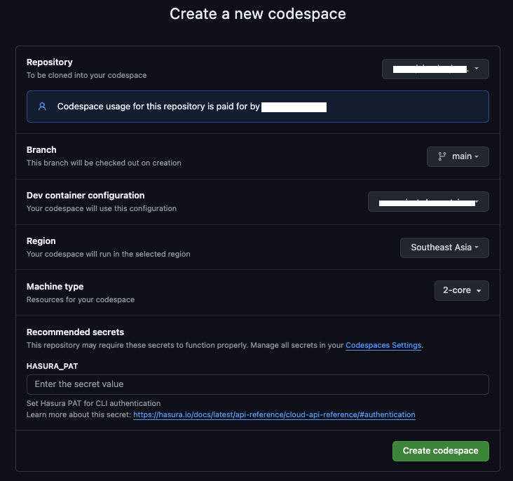
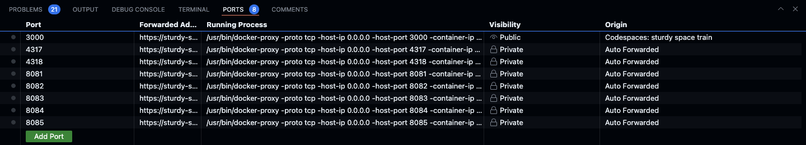
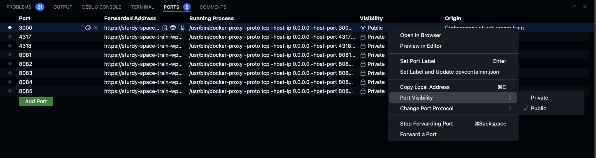

# Quickstart with GitHub Codespaces

[](https://codespaces.new/soorajshankar/ecommerce_codespace_test)

## Steps

1. **Provide the Hasura PAT as a secret**

   - When prompted, enter the Hasura PAT (Personal Access Token) as a secret.
   - 

2. **Start the engine and connector services**

   - Open a new terminal in the codespace.
   - Run the following command to start the Docker services:

     ```bash
     HASURA_DDN_PAT=$(ddn auth print-pat) docker compose -f docker-compose.hasura.yaml up
     ```

   - This will start the necessary Docker services for the Hasura engine and connectors.
   - 

3. **Start the TypeScript function runtime**

   - Open a new terminal in the codespace.
   - Navigate to the TypeScript connector directory:

     ```bash
     cd sales/connector/ts
     ```

   - Install the dependencies:

     ```bash
     npm install
     ```

   - Start the TypeScript function runtime:

     ```bash
     npx dotenv -e .env.local -- npm run watch
     ```

4. **Access the Hasura Console**

   - Update the port visibility for port 3000 to `PUBLIC` to access the Hasura Console. (without this you may access the URL that maps to port 3000 and try out queries, but we recommend you to use Hasura console for superior DX)
   - 
   - Open the Hasura Console using the following URL:

     ```
     https://console.hasura.io/local/graphql?url=https://<your-github-app-url>.app.github.dev/
     ```

   - You can now test the GraphQL API queries from the [Composability folder](https://github.com/hasura/ddn_beta_ecommerce/tree/main/Composability).

   - For example, to test the [AuthZ query](https://github.com/hasura/ddn_beta_ecommerce/blob/main/Composability/authZ.graphQL):
     - Set `x-hasura-role = customer` and `x-hasura-user-id = some_user_id` in the request headers.
     - Run the AuthZ query in the Hasura Console.

## Making Changes

After making changes to the Hasura configuration, you can rebuild the engine by executing the following command without restarting or rebuilding the Docker services. Docker's watch mode will automatically restart the engine with the new configuration:

```bash
ddn supergraph build local --output-dir ./engine
```

This quickstart guide provides a step-by-step process for setting up and running the Hasura DDN starter kit using GitHub Codespaces, allowing you to quickly start developing your ecommerce solution.
