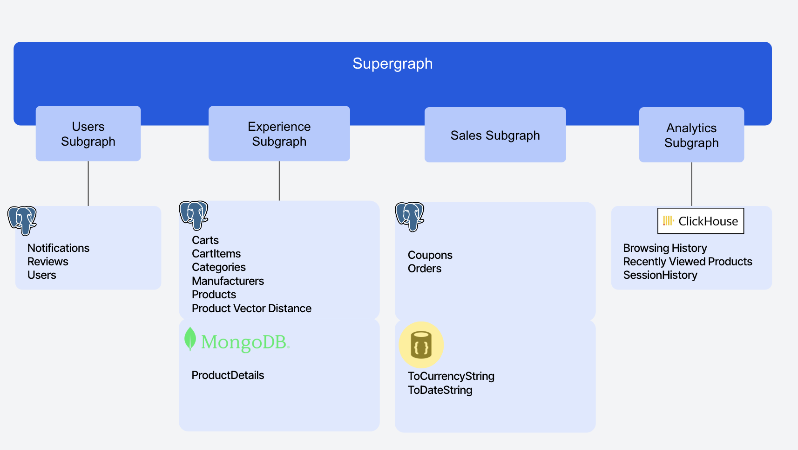
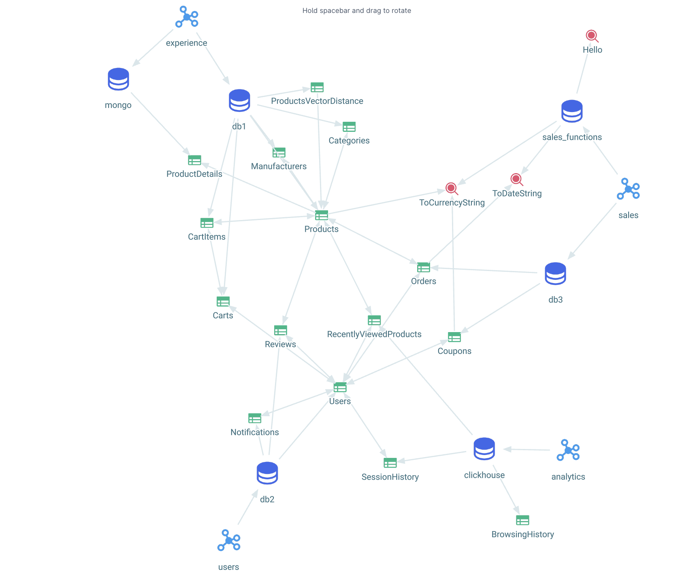

# Ecommerce App Demo using DDN (beta)
This demo showcases an Ecommerce App built using Hasura's Data Delivery Network (DDN) with the [supergraph.io](https://supergraph.io/) architecture. The supergraph is composed of four main subgraphs - users, analytics, experience, and sales, each backed by one or more data connectors. These subgraphs integrate various data sources to provide a comprehensive Ecommerce solution as follows.

### Subgraphs and Data Sources

- **users**
  - postgres (Users, Notifications, Reviews)
  
- **analytics**
  - clickhouse (BrowsingHistory, RecentlyViewedProducts, SessionHistory)
  
- **experience**
  - postgres (Cart, CartItems, Categories, Manufacturers, Products, ProductVectorDistance)
  - mongoDB (ProductDetails)
  
- **sales**
  - postgres (Coupons, Orders)
  - TypescriptFunctions (ToCurrencyString, ToDateString)

## Instructions

- [Install Hasura CLI](https://hasura.io/docs/3.0/cli/installation)
- [Login to Hasura CLI](https://hasura.io/docs/3.0/cli/commands/login)
- [Create Project](https://hasura.io/docs/3.0/cli/commands/create-project)
- Copy Project Name. Feel free to delete the project folders/files that were created. Cloning the repo will regenerate all of that for you. All you need is the project name.
- Git Clone [Repo](https://github.com/hasura/ddn_beta_ecommerce.git) and cd into it
- Go to Hasura.yaml and replace the project name with the one you get in the step above. Make sure you uncomment the project name. 
- Execute the following commands to set up your subgraphs (copy paste them and run them one by one as it is)
    - ddn delete subgraph app
        - Say Y to the prompt
    - ddn create subgraph users
    - ddn create subgraph sales
    - ddn create subgraph experience
    - ddn create subgraph analytics
- run [ddn build supergraph-manifest](https://hasura.io/docs/3.0/cli/commands/build-supergraph-manifest)
    - Heads up - it will take approximately 3 minutes to build
- go to console and test using GraphQL API queries from the [Composability folder](https://github.com/hasura/ddn_beta_ecommerce/tree/main/Composability).
  - For [AuthZ](https://github.com/hasura/ddn_beta_ecommerce/blob/main/Composability/authZ.graphQL): Set x-hasura-role = customer and x-hasura-user-id = some_user_id and run the AuthZ query

### Disclaimer
- This repo has credentials for databases, which are intentionally published by Hasura for demo purposes.
