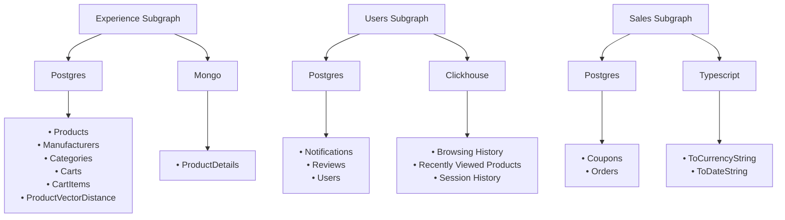
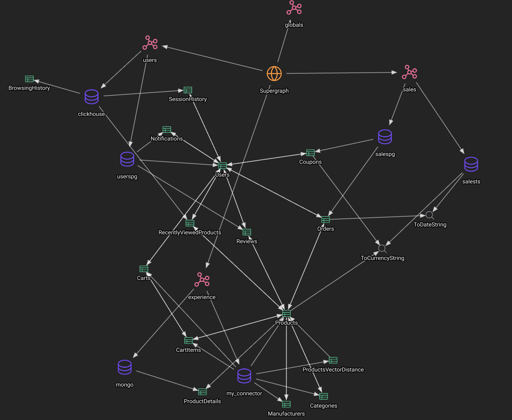
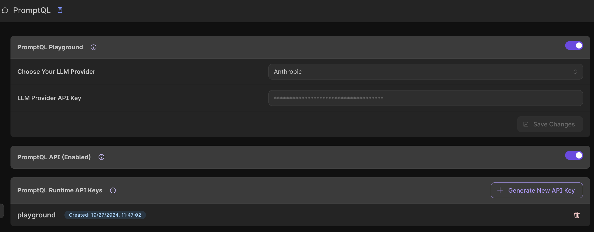
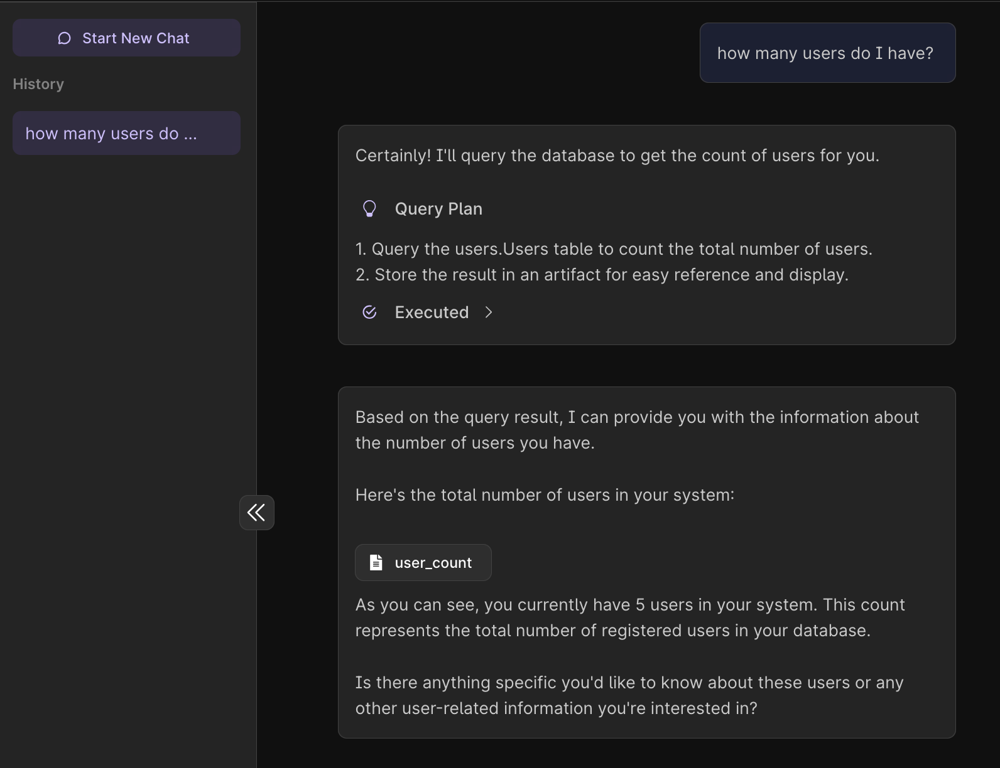
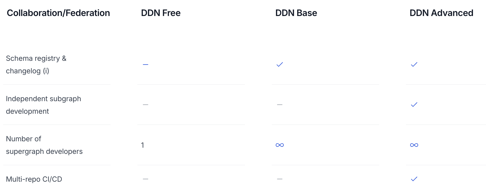

# Table of Contents

- [Table of Contents](#table-of-contents)
- [Ecommerce Application Demo using Data Delivery Network](#ecommerce-application-demo-using-data-delivery-network)
  - [Pre Requisites](#pre-requisites)
  - [Disclaimer](#disclaimer)
  - [Subgraphs and Data Sources](#subgraphs-and-data-sources)
  - [Local Development](#local-development)
  - [Deploy to DDN Cloud](#deploy-to-ddn-cloud)
  - [API Features](#api-features)
  - [Configure PromptQL](#configure-promptql)
  - [DDN Advanced](#ddn-advanced)
  - [Core Concepts](#core-concepts)
    - [Subgraph](#subgraph)
    - [Models](#models)
    - [Commands](#commands)
    - [Build Process](#build-process)

# Ecommerce Application Demo using Data Delivery Network

This demo repo provides a practical example of building an Ecommerce App using Hasura's [Data Delivery Network (DDN)](https://hasura.io/docs/3.0/getting-started/overview) with a [supergraph](https://supergraph.io) architecture.
Please note that a new release for the repo is out. Make sure to try the workflow again if you are a returning user.

## Pre Requisites

- [Install Hasura CLI & Login](https://hasura.io/docs/3.0/cli/installation)
- [Login into the Hasura CLI](https://hasura.io/docs/3.0/cli/commands/ddn_auth_login/)
- [Install Docker](https://docs.docker.com/engine/install/), you'll need docker compose v2.27.1 or later.
- [Install NodeJS](https://nodejs.org/en/download/package-manager)
  - Note we have business logic connectors in Python and Go as well. Download dependencies accordingly. We will be using Typescript in this example demo.
- Keep your Anthropic API Key ready (See: Getting started - Anthropic)

<!-- You may also use a pre-packed [codespace](https://github.com/features/codespaces) that pre-installs all the above and clone this project by clicking on the following link.

[](https://codespaces.new/hasura/ddn-sample-app) -->

## Disclaimer

This repository has credentials for databases, which are intentionally published by Hasura for demo purposes. These credentials allows for read-only access to synthetic datasets, which do not contain any user or customer sensitive data.

This example supergraph is composed of three subgraphs - users, experience, and sales, each backed by one or more data connectors. These subgraphs integrate various data sources to provide a comprehensive Ecommerce solution as follows.


<br><br>
## Subgraphs and Data Sources

- **Subgraph: users**
  - _Data Connector: postgres_
    - _Models_: Users, Notifications, Reviews
  - _Data Connector: clickhouse_
    - _Models_: BrowsingHistory, RecentlyViewedProducts, SessionHistory
- **Subgraph: experience**
  - _Data Connector: postgres_
    - _Models_: Cart, CartItems, Categories, Manufacturers, Products, ProductVectorDistance
  - _Data Connector: mongoDB_
    - _Models_: ProductDetails
- **Subgraph: sales**
  - _Data Connector: postgres_
    - _Models_: Coupons, Orders
  - _Typescript Functions_
    - _Commands_: ToCurrencyString, ToDateString

## Local Development

1. Git Clone this repo: https://github.com/hasura/ddn-sample-app.git and cd into it
   
2. Build the supergraph locally using the following command 
```shell 
   ddn supergraph build local 
```

3. Run Docker. For local development, Hasura runs several services (engine, connectors, auth, etc.), which use the following ports: 3000, 4317 and so on. Please ensure these ports are available. If not, modify the published ports in the Docker Compose files from this repository accordingly.
```shell 
   ddn run docker-start
```

4. Check out the console to discover and test the GraphQL API 
```shell 
   ddn console --local
``` 
  4a. DDN also supports JSON API as output. The feature is out in experimental phase.
  Run the following command to  fetch the openapi JSON file. An example of the swagger file is shown here.
```shel
  curl http://localhost:3000/v1/rest/__schema > ddn_openapi.json
```

Test using GraphQL API queries from the [Composability folder](https://github.com/hasura/ddn_beta_ecommerce/tree/main/Composability).
  - For [AuthZ](https://github.com/hasura/ddn_beta_ecommerce/blob/main/Composability/authZ.graphQL): Set x-hasura-role = customer and x-hasura-user-id = some_user_id and run the AuthZ query



<br><br>
5. To rebuild after any changes, you may run the following command to get the changes reflected.

  ```shell
  ddn supergraph build local
  ```

## Deploy to DDN Cloud

1. Initiate a new DDN Project

```shell
ddn project init
  ```

This will create a new project and shows the project name output in the terminal. You get an output such as below - 

```shell
+-----------+--------------------------------+
| Project   | sincere-turtle-2027            |
+-----------+--------------------------------+
| Subgraphs | globals,experience,sales,users |
+-----------+--------------------------------+
```

2. Make sure your own project name shows up in [.hasura/context.yaml](.hasura/context.yaml). Run the following just in case.

```sh
ddn context set project <Project Name>

# ddn context set project vast-buzzard-0000
# 5:36PM INF Key "project" set to "vast-buzzard-0000" in the context successfully
```

3. Create a Supergraph Build. This will also create the connector builds automatically.
   
```shell
ddn supergraph build create
```
> ⚠️ First Time Build can take 8 to 10 mins. Subsequent builds will be faster because of caching. Recommend

If you want to just make metadata changes and quickly see changes without rebuilding the connectors, run the following command:

```shell
ddn run build-supergraph
```
This is a script which passes the flag `--no-build-connectors`

> Note: Once deployed to your new project, if you don't have any connector changes, you can only rebuild supergraph alone, ie. connectors are only need to be deployed when there is change (data schema changes, functions etc.)


4. Go to console and test using GraphQL API queries from the [Composability folder](https://github.com/hasura/ddn_beta_ecommerce/tree/main/Composability).

## API Features

I'll analyze this GraphQL query and list down all the features being used:

1. **Basic Query Selection**
   - Main query named `ProductHomePage`
   - Aliasing (`topTShirtsInUS` for products query)

2. **Filtering and Sorting Operations**
   - Basic field filtering (`countryOfOrigin: {_eq: "US"}`)
   - Category filtering using UUID
   - Rating filtering (`_gt` operator)
   - Ascending order by distance (`order_by: { distance: Asc }`)

3. **Remote Relationships in Predicates**
   - Reviews relationship used in filtering conditions

4. **Pagination**
   - Using `offset` parameter (value: 1)
   - Using `limit` parameter (value: 5)

5. **Same Database Join**
   - Manufacturers table join with aliasing (`manufacturedBy`)

6. **Cross-Database Operations**
   - Integration with Clickhouse and MongoDb databases
     - With Custom (Native Queries)
   - Session history tracking and Product Details

7. **Multi-Level Nested Joins**
   - Two-level: Products → Orders
   - Three-level: Products → Orders → Users

8. **Nested Filtering**
   - Filtering within reviews section

9. **Nested Sorting**
   - Sorting by category name in ascending order
   - Sorting reviews by rating in descending order

10. **Nested Pagination**
   - Top N reviews selection (limit: 3)
   - Filtering by date in nested query
   - Sorting in nested query

11. **Field Selection**
    - Basic fields (id, name, price, description)
    - Nested fields (createdAt, lastSeen)
    - Custom field aliases
  
12. **Data Transformations**

    - Date and Currency formatting transformations
    - TypeScript function integrations for formatting

13. **Vector Search Operations**

    - Main query named SearchProductsVector
    - Vector distance calculation based on query vector
    - 50-dimensional vector input
    - Similarity-based ranking

14. **Query Arguments**

    - Vector argument passing using args parameter
    - Query vector as a string of floating-point numbers
    - Pre-computed embedding vector input

## Configure PromptQL

1. Enable PromptQL by going to the console


<br><br>
2. Start asking questions about the data


<br><br>
Get round-the-clock support on our Discord Server [here](https://bit.ly/3YhGP8d).

<br>
## DDN Advanced

Two Main Features 
- Independent Subgraph Development
- Multi Repo CI/CD


<br><br>
See more details on DDN Advanced [here](https://hasura.io/pricing).

**Switch to this branch to start the DDN Advanced Workflow - https://github.com/hasura/ddn-sample-app/tree/multirepo/team1admin**
<br><br><br><br>
## Core Concepts

The following section outlines the core concepts of Hasura DDN, providing a deeper understanding of its architecture and functionality.

### Subgraph

For a multi-team organization working on a Hasura project, it can make sense for any one team to not have access to all metadata objects. Subgraphs introduces the notion of a module system for your Hasura metadata. Think of it is as an independent domain consisting of one or more data sources.
[Read More](https://hasura.io/docs/3.0/project-configuration/subgraphs/)

### Models

Models are the link between your data connectors and the API Hasura generates. A model may be backed by a database table, an ad-hoc SQL query, a pre-materialized view, a custom REST or GraphQL API server, etc.
[Read More](https://hasura.io/docs/3.0/supergraph-modeling/models/)

### Commands

Commands are backed by functions or procedures declared in a DataConnectorLink allowing you to execute business logic directly from your GraphQL API. You can use them to validate, process or enrich data, call another API, or even log a user in.

[Read More](https://hasura.io/docs/3.0/supergraph-modeling/commands)

### Build Process

A build is a fully-functional, immutable supergraph API which is built based on your project's configuration.

During the build process, Hasura builds and deploys all the data connectors and supergraph builds. This includes connector configurations, models, functions, and all other related components, which are integrated into the deployments.

Considering the size of the supergraph and separate deployments, it may initially take some time to complete. Once deployed, the supergraph provides a unified GraphQL API that leverages the capabilities of all subgraphs to offer a comprehensive Ecommerce solution.
