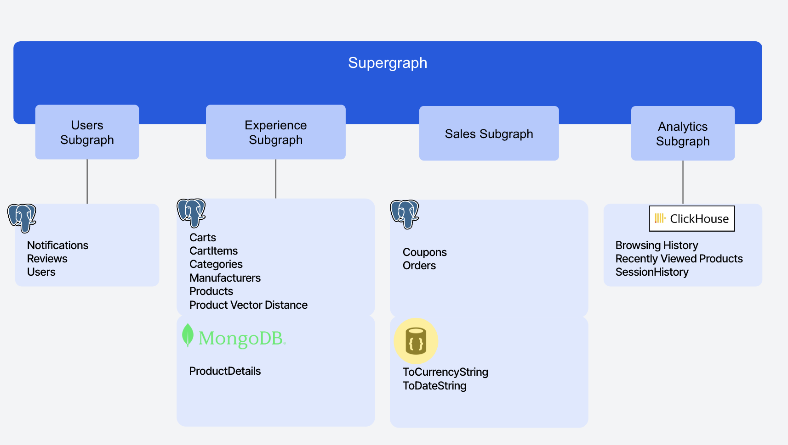
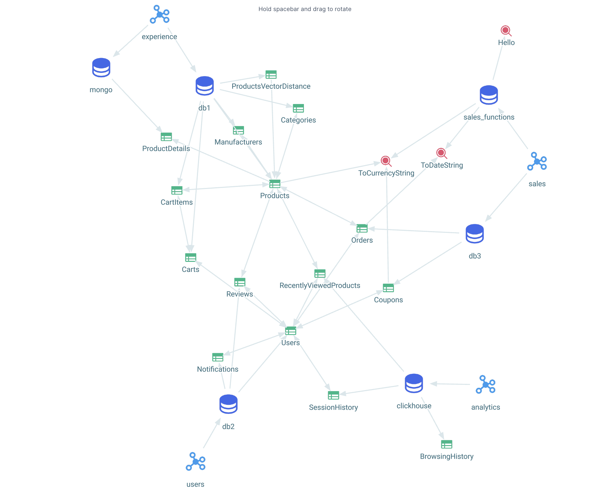

# Ecommerce App Demo using DDN (beta)

This demo provides a practical example of building an Ecommerce App using Hasura's Data Delivery Network (DDN) with a [supergraph](https://supergraph.io) architecture.

## Instructions
- [Install Hasura CLI](https://hasura.io/docs/3.0/cli/installation)
- [Login to Hasura CLI](https://hasura.io/docs/3.0/cli/commands/login)
- [Create Project](https://hasura.io/docs/3.0/cli/commands/create-project)
- Copy Project Name. Feel free to delete the project folders/files that were created. Cloning the repo will regenerate all of that for you. All you need is the project name.
- Git Clone [Repo](https://github.com/hasura/ddn_beta_ecommerce.git) and cd into it
- Go to Hasura.yaml and replace the project name with the one you get in the step above. Make sure you uncomment the project name. 
- Execute the following commands to set up your subgraphs (copy paste them and run them one by one as it is)

```sh
ddn delete subgraph app # Choose Y when prompt, this is because this project does not require app subgraph
ddn create subgraph users
ddn create subgraph sales
ddn create subgraph experience
ddn create subgraph analytics
```

- run [ddn build supergraph-manifest](https://hasura.io/docs/3.0/cli/commands/build-supergraph-manifest) -d "Description of Build"
    - Heads up - it will take approximately 3 minutes to build
    - For more details on the build process, refer to the [Build Process](#build-process) section.
- go to console and test using GraphQL API queries from the [Composability folder](https://github.com/hasura/ddn_beta_ecommerce/tree/main/Composability).
  - For [AuthZ](https://github.com/hasura/ddn_beta_ecommerce/blob/main/Composability/authZ.graphQL): Set x-hasura-role = customer and x-hasura-user-id = some_user_id and run the AuthZ query

This example supergraph is composed of four subgraphs - users, analytics, experience, and sales, each backed by one or more data connectors. These subgraphs integrate various data sources to provide a comprehensive Ecommerce solution as follows.



### Subgraphs and Data Sources
- **Subgraph: users**
  - *Data Connector: postgres*
    - *Models*: Users, Notifications, Reviews
- **Subgraph: experience**
  - *Data Connector: postgres*
    - *Models*: Cart, CartItems, Categories, Manufacturers, Products, ProductVectorDistance
  - *Data Connector: mongoDB*
    - *Models*: ProductDetails
  
- **Subgraph: sales**
  - *Data Connector: postgres*
    - *Models*: Coupons, Orders
  - *Typescript Functions*
    - *Commands*: ToCurrencyString, ToDateString

- **Subgraph: analytics**  
  - *Data Connector: clickhouse*
    - *Models*: BrowsingHistory, RecentlyViewedProducts, SessionHistory



## Disclaimer
This repository has credentials for databases, which are intentionally published by Hasura for demo purposes. These credentials allows for read-only access to synthetic datasets, which do not contain any user or customer sensitive data.

# Core Concepts
The following section outlines the core concepts of Hasura DDN, providing a deeper understanding of its architecture and functionality.

## Subgraph

For a multi-team organization working on a Hasura project, it can make sense for any one team to not have access to all metadata objects. Subgraphs introduces the notion of a module system for your Hasura metadata. Think of it is as an independent domain consisting of one or more data sources.
[Read More](https://hasura.io/docs/3.0/project-configuration/subgraphs/)

## Models
Models are the link between your data connectors and the API Hasura generates. A model may be backed by a database table, an ad-hoc SQL query, a pre-materialized view, a custom REST or GraphQL API server, etc.
[Read More](https://hasura.io/docs/3.0/supergraph-modeling/models/)

## Commands
Commands are backed by functions or procedures declared in a DataConnectorLink allowing you to execute business logic directly from your GraphQL API. You can use them to validate, process or enrich data, call another API, or even log a user in.

[Read More](https://hasura.io/docs/3.0/supergraph-modeling/commands)

## Build Process

A build is a fully-functional, immutable supergraph API which is built based on your project's configuration.

During the build process, Hasura builds and deploys all the data connectors and supergraph builds. This includes connector configurations, models, functions, and all other related components, which are integrated into the deployments.

Considering the size of the supergraph and separate deployments, it may initially take some time to complete. Once deployed, the supergraph provides a unified GraphQL API that leverages the capabilities of all subgraphs to offer a comprehensive Ecommerce solution.
