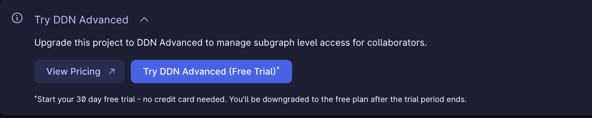
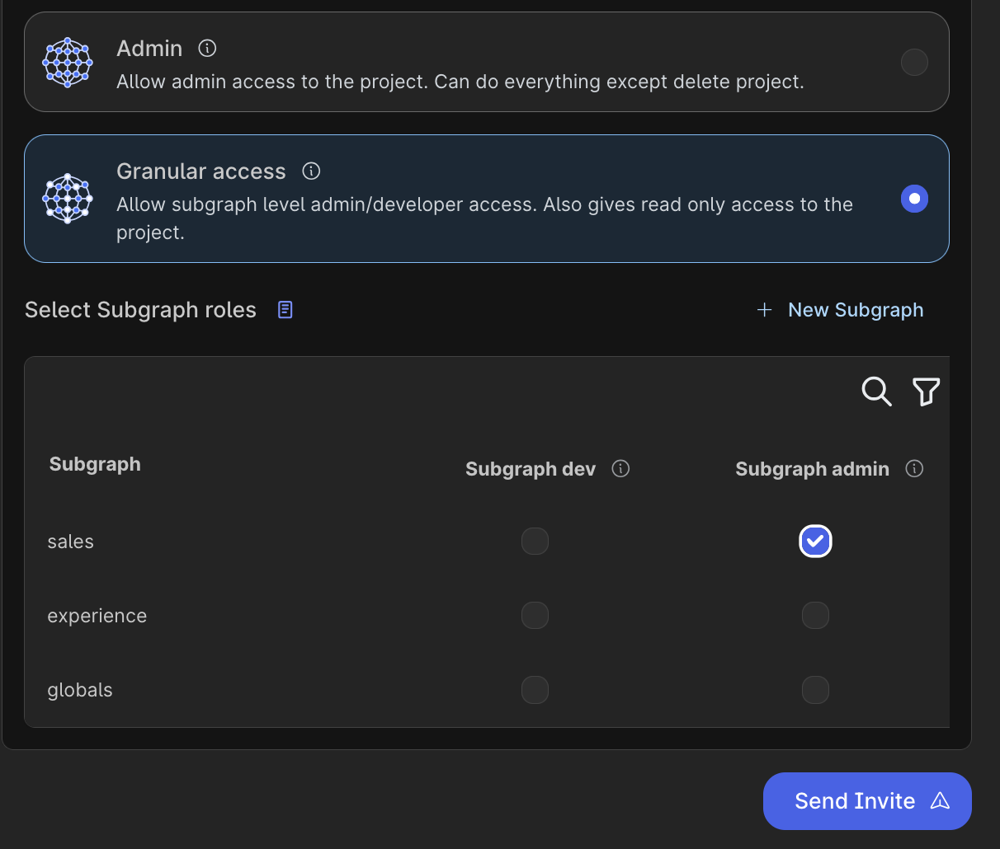

# Table of Contents

- [Table of Contents](#table-of-contents)
  - [DDN Advanced](#ddn-advanced)
  - [Core Concepts](#core-concepts)
    - [Subgraph Builds](#subgraph-builds)

## DDN Advanced

Two Main Features 
- Independent Subgraph Development
- Multi Repo CI/CD


See more details on DDN Advanced [here](https://hasura.io/pricing).

**DDN Advanced Workflow**

Team 1 owner of experience subgraph is also the admin of the supergraph.
It is recommended to shut down all DDN related dockers before starting.

1. Team1 sets up the globals and experience subgraphs

Build the supergraph locally using the following command 
```shell 
   ddn supergraph build local 
```

Run Docker.
```shell 
   ddn run docker-start
```

Check out the console to discover and test the API 
```shell 
   ddn console --local
```

Initiate a new DDN Project

```sh
ddn project init
```

Make sure your own project name shows up in [.hasura/context.yaml](.hasura/context.yaml). Run the following just in case.

```sh
ddn context set project <Project Name>

# ddn context set project vast-buzzard-0000
# 5:36PM INF Key "project" set to "vast-buzzard-0000" in the context successfully
```
Create a Supergraph Build. This will also create the connector builds automatically.
   
```shell
ddn supergraph build create
```
Explore API on the console
```shell
ddn console --build-version 37036d3c05
```

Apply the build to the project to get the consumer facing API URL for the first time.
   
```shell
ddn supergraph build apply <build-version>
```

2. Team1 creates new subgraph "sales" and invites Team2 to the project which owns the "sales" domain.

Create Subgraph name "Sales"
```shell
ddn project subgraph create sales
```
Go to Console and upgrade to DDN Advanced Tier
(this is needed to provide subgraph level access to Team 2 Admin).


After starting DDN Advanced Free Trial, go to the Console and click Share.
Enter the email ID of Team2 Admin and press invite.


3. *Git Clone https://github.com/hasura/ddn-federation-sample-team2 *

To continue with the Team2 workflow.
